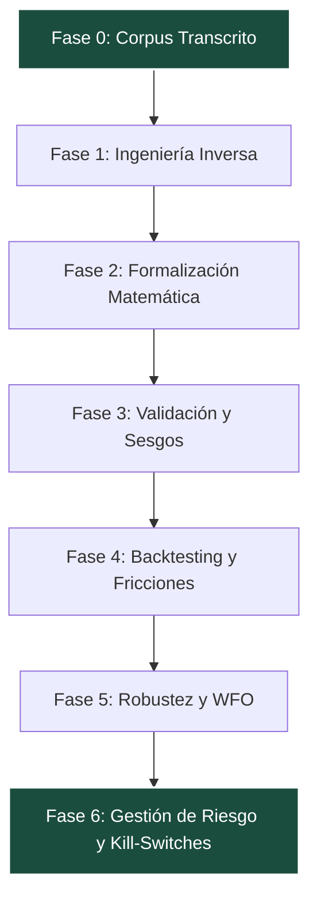

# SATAR-1 — Informe de Auditoría y Validación Completa (Fases 1–6)

**Proyecto:** Sistema de Trading Automatizado — Metodología Alex Ruiz (SATAR-1)  
**Fecha de Auditoría:** 2026-07-07  
**Estado General del Proyecto:** **EN DESARROLLO (Fase 6 Completada)**  
**Objetivo de la Auditoría:** Analizar la coherencia entre el objetivo general del proyecto, la planificación teórica de las Fases 1-6 y el desarrollo de código realizado en Python y Pine Script.

---

## 1. Análisis de Alineación: Objetivo vs. Plan y Desarrollo

El objetivo principal de **SATAR-1** es automatizar e institucionalizar la metodología discrecional de impulso-pullback-continuación de Alex Ruiz (**Pilar C**), integrando una meta-capa de control de régimen de mercado mediante un modelo de Markov Oculto (**Pilar B**) para modular el riesgo, y validando la infraestructura con una estrategia base de Claude (**Pilar A**).

El plan y el desarrollo se adaptan a este objetivo mediante un flujo metodológico riguroso:



### Evaluación de Coherencia de las Fases (1 a 6):
1. **Fase 1 (Ingeniería Inversa):** Traduce con éxito la narrativa informal de los videos a un catálogo estructurado de reglas operativas clasificadas por ID (`R-Cxx`, `R-Bxx`, `R-Axx`).
2. **Fase 2 (Formalización Matemática):** Elimina la subjetividad del trading discrecional traduciendo conceptos como "gráfico limpio" y "desaceleración" a fórmulas explícitas utilizando indicadores estandarizados (ADX, Efficiency Ratio, ATR).
3. **Fase 3 (Validación de Consistencia):** Resuelve de forma lógica las 8 ambigüedades de la estrategia y cataloga los 7 sesgos metodológicos (especialmente el sesgo de selección del Pilar A y el sesgo de look-ahead de los fractales).
4. **Fase 4 (Backtesting):** Diseña un protocolo riguroso in-sample / out-of-sample / holdout (60/25/15) con comisiones, spread, slippage y swaps reales.
5. **Fase 5 (Robustez):** Configura un esquema de optimización Walk-Forward (WFO) y simulaciones de Monte Carlo para estresar fricciones y precios.
6. **Fase 6 (Gestión de Riesgo):** Diseña un sistema de control de riesgo institucional: riesgo base del 1%, límites jerárquicos (diario, semanal, mensual), reducción dinámica de posición por racha de pérdidas, y watchdogs operacionales.

---

## 2. Auditoría de Código: Hallazgos Críticos y Discrepancias

Al contrastar la especificación matemática de la **Fase 2** y las reglas de riesgo de la **Fase 6** contra el código real implementado en Python (`satar_backtest.py`) y Pine Script (`SATAR1_PilarC.pine`), se han detectado **5 hallazgos críticos** que representan desviaciones o bugs de implementación:

### ⚠️ Hallazgo 1: Omisión de la condición de cierre del Pinbar en Pine Script (Bug Crítico de Señal)
* **Especificación (Fase 2 §3 - G5b):** El patrón pinbar requiere que el cierre esté en el extremo opuesto de la mecha larga:  
  `C_t <= (H_t + L_t)/2 + 0.1*(H_t - L_t)` (para short).
* **Python (`satar_backtest.py` L262):** Implementado correctamente.  
  `c0 <= (h0 + l0) / 2 + 0.1 * (h0 - l0)`
* **Pine Script (`SATAR1_PilarC.pine` L149):** Se omitió por completo la verificación del cierre.  
  `pinS = math.abs(dC-dO) > 0 and (dH - math.max(dO, dC)) >= pPinRatio * math.abs(dC-dO)`
* **Impacto:** Pine Script activará señales falsas en velas que tengan una mecha superior larga pero cuyo precio de cierre no esté en el 10% inferior del rango total, rompiendo la paridad con Python.

### ⚠️ Hallazgo 2: Omisión del Quiebre de Neckline en Doble Techo/Suelo (Ambas Plataformas)
* **Especificación (Fase 2 §3 - G5c):** El patrón de Doble Techo exige que el precio cruce y cierre por debajo del mínimo intermedio (neckline) entre los dos picos.
* **Código (Python L265 y Pine L150):** Ambas plataformas omiten el chequeo del neckline. Se limitan a verificar si los dos últimos pivotes confirmados en el array están a una distancia menor a `pDTopTol * ATR`.
* **Impacto:** El algoritmo asume un Doble Techo completado en el momento en que se confirma el segundo pivote alto, incluso si el precio está cotizando en un rango intermedio elevado sin haber roto el soporte del patrón.

### ⚠️ Hallazgo 3: Omisión del Swing High/Low en Stop Loss de Profundidad (Ambas Plataformas)
* **Especificación (Fase 2 §6):** Si la corrección en la temporalidad intermedia supera el 0.618 (`depth > 0.618`), el Stop Loss inicial debe colocarse por encima del extremo estructural:  
  `SL0 = max(Fib(1.0), último SH_I) + buffer` (para short).
* **Código (Python L413 y Pine L217):** Ambos códigos calculan el SL0 utilizando únicamente el nivel 1.0 del Fibonacci (`fib(1.0) + buffer`), omitiendo la comparación con el último `SH_I` estructural.
* **Impacto:** Si el último swing High intermedio fue superior al inicio del Fibonacci debido a mechas previas, el Stop Loss quedará desprotegido frente a la liquidez estructural real.

### ⚠️ Hallazgo 4: Drift en la Referencia de los Límites del Kill-Switch (Bug en Python)
* **Especificación (Fase 6 §2 y §5):** Los límites de pérdida diaria (−2%), semanal (−4%) y mensual (−6%) deben calcularse sobre el equity de referencia (actualizado al cierre del mes anterior).
* **Pine Script (L195-204):** Implementado correctamente usando `timeframe.change` para capturar el equity al inicio de cada periodo.
* **Python (`satar_backtest.py` L348):** Calcula los límites multiplicando el porcentaje por el capital inicial del backtest (`self.equity0`):  
  `b.get(k, 0.0) <= -lim * self.equity0`
* **Impacto:** Si la cuenta crece (ej. dobla capital a $20,000), el bot en Python detendrá la operativa al perder $200 diarios (1% del equity actual), en lugar de tolerar el límite real del 2% ($400). Si la cuenta decrece, el bot permitirá drawdowns mucho mayores que el 2% efectivo del balance actual.

### ⚠️ Hallazgo 5: Asimetría Crítica del Pilar B (HMM) entre Python y Pine
* **Desarrollo:** El filtro HMM está completamente ausente en el código de TradingView (`SATAR1_PilarC.pine`), ya que Pine Script v6 carece de capacidad nativa para ejecutar modelos markovianos Gaussianos.
* **Impacto:** La estrategia en TradingView opera a ciegas del régimen HMM, ejecutando señales al 100% de riesgo en fases que el backtest en Python clasifica como "crisis" (exposición 0%) o "rango" (exposición 50%).

---

## 3. Matriz de Paridad y Validación

| Módulo / Regla | Especificación (Fase 2) | Implementación Python | Implementación Pine | ¿Paridad? |
| :--- | :--- | :--- | :--- | :--- |
| **G1 (Filtro Limpieza)** | ER(20) y ADX(14) | Sí (L215) | Sí (L140) | **Sí** |
| **G2 (Toque Extremo)** | Ventana lookback zonas | Sí (L224) | Sí (L145) | **Sí** (Aproximado) |
| **G4 (Desaceleración)** | Mean Body/ATR10 < 0.6 | Sí (L240) | Sí (L141) | **Sí** |
| **G5b (Pinbar)** | Cierre en 10% inferior | Sí (L262) | No (L149) | **NO (Falta regla de cierre)** |
| **G5c (Doble Techo)** | Ruptura de Neckline | No (L265) | No (L150) | **NO (Omitido en ambos)** |
| **SL0 (Stop Profundo)** | Max(Fib(1.0), SH_I) | No (L413) | No (L217) | **NO (Usa solo Fib(1.0) en ambos)** |
| **Trailing Stop (D-6)** | EMA 50 H1 + 0.1 ATR | Sí (L442) | Sí (L236) | **Sí** |
| **Kill-Switch (Riesgo)** | Drawdown por periodos | Sí (L348 - Bug equity0) | Sí (L202 - Correcto) | **NO (Métrica base difiere)** |
| **Pilar B (HMM)** | Filtro de régimen | Sí (L510) | No | **NO (Ausente en Pine)** |

---

## 4. Conclusiones y Recomendaciones de Implementación

El plan del proyecto es **excepcionalmente robusto en su diseño teórico**. La transición de la Fase 0 (corpus) a la Fase 6 (riesgo) es coherente, matemática y está bien estructurada para evitar los sesgos típicos del trading minorista.

Sin embargo, el **desarrollo técnico presenta desviaciones de diseño y bugs de código** que distorsionarán los resultados del backtesting real de la Fase 4 y romperán la reproducibilidad entre Python y TradingView.

### Acciones Recomendadas antes de iniciar la Fase 4 (Ejecución de Backtest con datos reales):

1. **Corregir el Pinbar en Pine Script:** Añadir la validación del cierre al código de la estrategia en TradingView:
   ```pinescript
   pinS = math.abs(dC-dO) > 0 and (dH - math.max(dO, dC)) >= pPinRatio * math.abs(dC-dO) and dC <= (dH+dL)/2 + 0.1*(dH-dL)
   ```
2. **Corregir el SL de Profundidad en Python y Pine:** Incorporar el máximo entre el nivel 1.0 y el último swing estructural confirmado (`shI1` / `slI1`).
3. **Corregir la Referencia del Kill-Switch en Python:** Modificar `satar_backtest.py` para que calcule la pérdida del periodo usando el balance al inicio del día/semana/mes, en lugar del capital inicial inalterado.
4. **Diseñar el Bridge de Ejecución (Fase 7/8):** Para resolver la ausencia del HMM en TradingView, la arquitectura de automatización de producción debe estructurarse de la siguiente manera:
   ```
   TradingView (Alerta de Señal Pilar C) ──▶ Servidor VPS (Python Bridge con HMM) ──▶ Bybit API (Orden Filtrada)
   ```
   El script de Python intercepta la señal, corre la función `make_hmm_mult()` con los datos diarios actuales del activo, y decide si ejecuta la orden en Bybit y con qué tamaño (0%, 50% o 100%).
