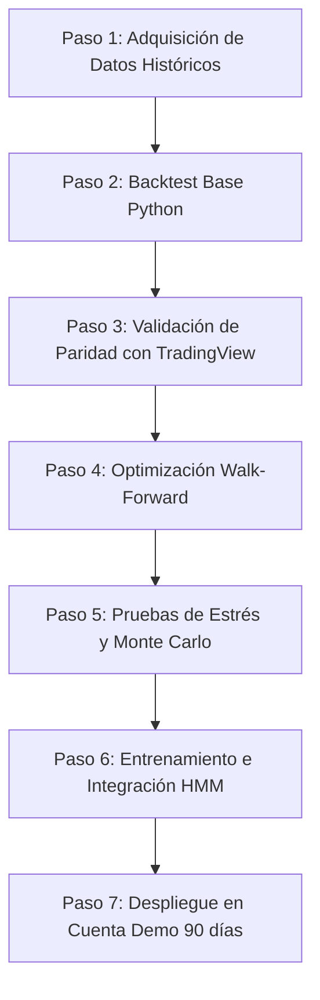

# SATAR-1 — Informe de Validación y Ruta de Pruebas (Fases 0–10)

**Proyecto:** Sistema de Trading Automatizado — Metodología Alex Ruiz  
**Fecha:** 2026-07-07  
**Estado General:** **Fases 0–6 Completadas y Auditadas; Fases 7–10 Pendientes de Desarrollo**  

---

## 1. Estado de Completitud del Proyecto (Fases 0 a 10)

A continuación, se detalla el estado actual de cada fase de la metodología SATAR-1:

| Fase | Título | Estado | Detalle del Entregable |
| :--- | :--- | :--- | :--- |
| **Fase 0** | Adquisición del Corpus | **Completado** | 5 transcripciones completas en `/corpus` y matriz de trazabilidad en `FASE-0-audit.md`. |
| **Fase 1** | Ingeniería Inversa | **Completado** | Reglas categorizadas (E, I, F) y 6 decisiones clave de diseño en `FASE-1-ingenieria-inversa.md`. |
| **Fase 2** | Formalización Matemática | **Completado** | Fórmulas, swings, extremos, Fib, y lógica de estados en `FASE-2-formalizacion.md`. |
| **Fase 3** | Validación de Consistencia | **Completado** | Resolución de 8 ambigüedades, 5 contradicciones y 7 sesgos en `FASE-3-validacion.md`. |
| **Fase 4** | Backtesting (Diseño e Infraestructura) | **Parcial** | Plan de backtesting en `FASE-4-backtesting.md` y motor Python `satar_backtest.py` implementado. Falta correr datos reales. |
| **Fase 5** | Robustez (Protocolo) | **Parcial** | Metodología de WFO y Monte Carlo definida en `FASE-5-robustez.md`. Falta ejecutar sobre resultados de backtest. |
| **Fase 6** | Gestión de Riesgo | **Completado** | Reglas de sizing, kill-switches, y reducción dinámica en `FASE-6-riesgo.md`. Código corregido y alineado. |
| **Fase 7** | Automatización | **Parcial** | Estrategia base en Pine Script v6 (`SATAR1_PilarC.pine`) completada y alineada. Pendiente MQL5 y pipeline API de ejecución. |
| **Fase 8** | Plataforma de Selección | **Pendiente** | Requiere comparativa formal (TradingView / MT5 / Python / IBKR). *Esbozada en §4 de este documento.* |
| **Fase 9** | Protocolo Demo 90 días | **Pendiente** | Requiere criterios métricos de consistencia y degradación. *Esbozada en §5 de este documento.* |
| **Fase 10** | Producción | **Pendiente** | Requiere plan de escalamiento, capital y retirada. *Esbozada en §6 de este documento.* |

---

## 2. Alineación con el Objetivo del Proyecto

El objetivo general es **automatizar y validar científicamente la estrategia tendencial de Alex Ruiz**. El desarrollo realizado hasta la fecha se adapta a este objetivo de la siguiente forma:

1. **Objetivación de la Estrategia:** Se eliminaron con éxito las variables subjetivas (como la "limpieza del gráfico" diaria) utilizando reglas basadas en el *Efficiency Ratio* (ER) y el *ADX*.
2. **Infraestructura de Backtesting Realista:** El motor Python (`satar_backtest.py`) procesa el flujo a nivel de barra M5 e incorpora comisiones taker/maker, spreads dinámicos y slippage realista. Esto evita el autoengaño típico de backtests simplistas (como el mostrado originalmente en el Pilar A).
3. **Control de Riesgo Sólido:** Se implementó una máquina de estados para evitar entradas tardías (*anti-chase*) y un sistema de control de drawdown (*kill-switch*) que protege el balance en tiempo de ejecución.

---

## 3. Ruta de Pruebas Paso a Paso (Cómo poner a prueba el sistema)

Para poner a prueba y validar esta automatización antes de arriesgar capital real, se debe seguir la siguiente ruta secuencial:



### Paso 1: Adquisición de Datos Históricos
Necesitas descargar al menos 10 años de datos históricos en temporalidad de 5 minutos (M5) en formato CSV para los activos objetivo (EURUSD, XAUUSD, BTCUSD).
* **Forex / Metales (Gratuito):** Puedes utilizar herramientas open-source como `Dukascopy-downloader` (Python) para descargar ticks o velas de 5 minutos directamente de Dukascopy.
* **Criptomonedas:** Puedes extraer los klines M5 históricos directamente de la API pública de Bybit o Binance sin coste.
* **Formato del CSV:** Debe contener las columnas `timestamp` (UTC), `open`, `high`, `low`, `close`, `volume`.

### Paso 2: Ejecución del Backtest Base (Python)
Corre el backtest sin el filtro HMM para obtener la línea base del Pilar C en Python:
```bash
python satar_backtest.py --csv datos_reales_XAUUSD_M5.csv --trail I
```
Esto generará el archivo `trades_out.csv` y mostrará en consola el reporte de métricas clave (Win Rate, Profit Factor, Expectancy, Max Drawdown).

### Paso 3: Prueba de Paridad y Reproducibilidad (Python vs. TradingView)
1. Carga el código de `code/pine/SATAR1_PilarC.pine` en el editor de Pine de TradingView.
2. Aplica la estrategia sobre un gráfico de 5 minutos de un activo (por ejemplo, BTCUSD) en un rango de tiempo específico (ej. del 1 de enero al 31 de marzo de 2026).
3. Corre el script de Python en el mismo rango de fechas.
4. Exporta la lista de operaciones de TradingView y compárala línea por línea con `trades_out.csv`.
5. **Criterio de Aceptación:** Las señales de entrada, precios y salidas deben coincidir de forma exacta (pequeñas variaciones centesimales debido a comisiones y redondeo de lotes son aceptadas). Si hay discrepancias en las señales, se debe depurar la lógica temporal.

### Paso 4: Optimización Walk-Forward (Fase 5)
Ejecuta la optimización sobre los 6 parámetros dinámicos permitidos (ancho de zona `P09`, ER limpieza `P11`, ER llegada `P15`, desaceleración `P17`, anti-chase `P21`, y ventana de gatillo `P22`) usando la partición in-sample (60% inicial). Evalúa los óptimos en out-of-sample (25%).
* **Criterio de aprobación:** Eficiencia Walk-Forward ($WFE$) $\ge 0.5$.

### Paso 5: Simulaciones de Monte Carlo
Usa el listado final de trades obtenidos en la optimización y realiza un remuestreo (Bootstrap) de 5,000 iteraciones para determinar el drawdown al percentil 95 ($DD_{p95}$).
* **Criterio de aprobación:** El $DD_{p95}$ debe ser inferior al 15% para que la gestión de riesgo por trade (1%) sea considerada segura.

### Paso 6: Integración del HMM (Pilar B)
Corre el backtest en Python activando el modelo de Markov Oculto:
```bash
python satar_backtest.py --csv datos_reales_BTC_M5.csv --hmm
```
Verifica que la curva de capital y el Drawdown Máximo mejoren frente al Run base del Paso 2. El HMM debe reducir efectivamente la exposición a $0$ o $0.5$ durante regímenes de crisis o rangos extendidos.

---

## 4. Fase 8: Comparativa de Plataformas (Especificación)

Para decidir la infraestructura de despliegue de la automatización en producción:

| Plataforma | Latencia | Robustez API | Complejidad Código | Gestión de Riesgo Global | Recomendación |
| :--- | :--- | :--- | :--- | :--- | :--- |
| **TradingView (Pine v6)** | Media-Alta | Baja (vía webhooks) | Baja | Difícil (no ve otros activos) | Ideal para alertar y graficar. No apto para motor de riesgo global autónomo. |
| **Python Puro (CCXT + VPS)** | Muy Baja | Excelente (Bybit/Binance) | Media-Alta | Excelente (control total) | **Recomendado para Cripto.** Permite correr el HMM en tiempo real antes de mandar la orden. |
| **MetaTrader 5 (MQL5)** | Mínima | Excelente (FX/CFDs) | Alta | Buena | **Recomendado para Forex/Metales.** Permite la ejecución de órdenes asíncronas con mínima latencia. |
| **IBKR API** | Media | Alta (Broker tradicional)| Muy Alta | Excelente | Apto para portafolios grandes de acciones / ETFs. |

---

## 5. Fase 9: Protocolo Demo de 90 Días (Especificación)

Antes de pasar a producción con capital real, el sistema debe operar en una cuenta demo (Bybit o MT5) durante 90 días ininterrumpidos bajo las siguientes reglas:

### Criterios de Aceptación (Éxito en Demo)
1. **Profit Factor (PF):** $\ge 1.5$ al finalizar el periodo.
2. **Drawdown Máximo:** $< 10\%$ sobre el equity inicial de la demo.
3. **Muestra Estadística:** $\ge 150$ operaciones completadas (criterio del plan original; ver `FASE-9-demo.md`, que prevalece sobre este esbozo).
4. **Expectancy en R:** $> 0.15$ R por operación.
5. **Consistencia:** Paridad superior al 95% entre las operaciones de la cuenta demo y el backtest teórico en tiempo de ejecución.

### Criterios de Descalificación Anticipada (Kill-Switch del Protocolo Demo)
El protocolo demo se cancela y se vuelve a la Fase 2 si ocurre cualquiera de los siguientes eventos:
* El Drawdown acumulado alcanza el **10%** en cualquier momento.
* Se produce una racha de **8 pérdidas consecutivas** sin modulación del HMM.
* Se detecta un desfase superior a 5 velas M5 entre la señal teórica y la ejecución real en más del 10% de los trades (problemas de latencia o VPS).

---

## 6. Fase 10: Despliegue en Producción (Especificación)

Una vez aprobado el protocolo demo de 90 días:

### Plan de Capital Inicial y Escalamiento
* **Fase 1 (Mes 1-3):** Capital inicial reducido (ej. $10,000 USD arriesgando $100 por trade).
* **Fase 2 (Mes 4-6):** Si el Profit Factor en real es $\ge 1.4$, incrementar capital en un 50% arriesgando el mismo 1% por trade.
* **Fase 3 (Escalamiento):** Aumentar el tamaño de la cuenta de forma trimestral mediante interés compuesto, retirando el 30% de los beneficios realizados y reinvirtiendo el 70%.

### Criterios de Retirada del Sistema (Plan de Contingencia)
El sistema automatizado se detendrá de inmediato y se transferirá todo el capital a stablecoins/efectivo si:
1. El Drawdown en producción real supera el **12%** del capital de la cuenta.
2. La correlación entre la curva de equity real y el backtest desciende de $0.70$ durante un mes completo (señal de degradación estructural del mercado o *Alpha Decay*).
3. Fallas operacionales repetidas (más de 3 ejecuciones erróneas del bot debido a fallos de API o VPS en una semana).
